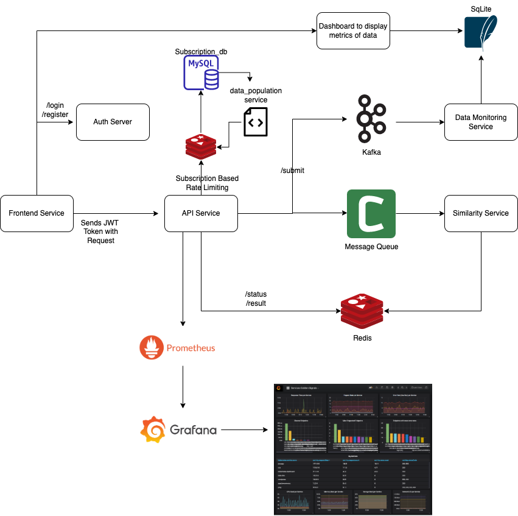
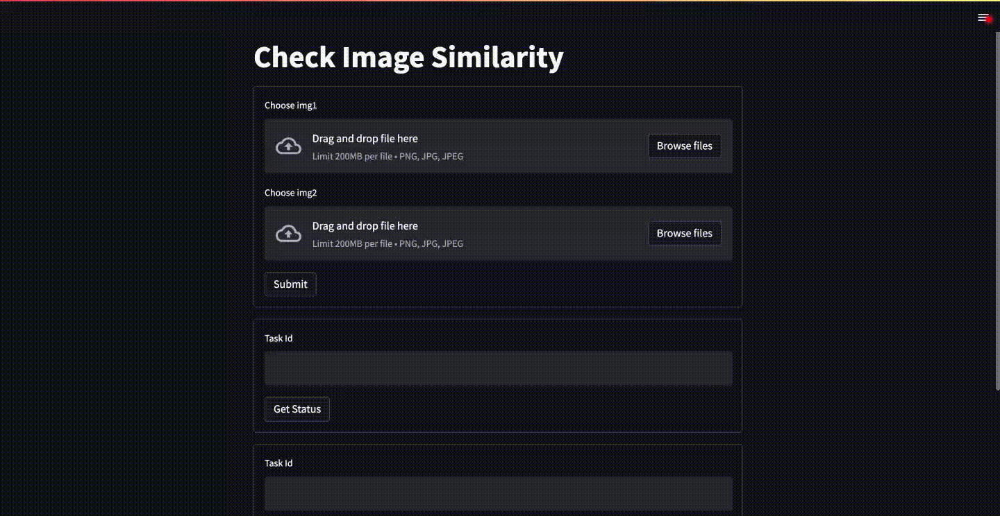

## Intro:
Dis-Sim is a Microservices architecture based distributed image similarity measuring system. It uses asynchronous message queue to communicate across microservices. Its distributed architecture makes it highly scalable and fault tolerant.




### Demo:



### Getting started:
1. Run `docker-compose up --build` to create and start all the containers. (Use `-d` flag to run the container in the background)
2. Open the browser and navigate to `localhost:8501`. Note that `8501` is the port specified in the dockerfile of the `frontend` service (`src/frontend/Dockerfile`).


### Using custom similarity measurer:
Adding a custom similarity measurer is as simple as overwriding the `similarity` function in the `src/similarity/models` module.
```python
# import your new similarity measurer

from my_similarity_measurer import MySimilarityMeasurer
```

```python
# add your new similarity measurer in similarity method

@app.task
def similarity(img1, img2) -> float:
    ...

    score = MySimilarityMeasurer().similarity(img1, img2)
    return score
```

Make sure to add the dependencies of your new similarity measurer in `src/similarity/requirements.txt`

### Benchmarks:
- Load Testing: [here](./test/load_test)


### References:
- [Docker](https://www.docker.com/)
- [Docker Compose](https://docs.docker.com/compose/install/)
- [FastAPI](https://fastapi.tiangolo.com/)
- [Streamlit](https://streamlit.io/)
- [Celery](https://celery.readthedocs.io/en/latest/)
- [Redis](https://redis.io/)

- [Microservices Architecture](https://en.wikipedia.org/wiki/Microservice)
- [Message Queue](https://en.wikipedia.org/wiki/Message_queue)
 

### Further Reading:
- [Naming Release Versions](https://py-pkgs.org/07-releasing-versioning.html#version-numbering)
