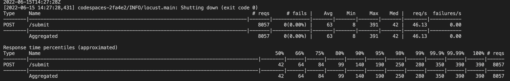

## Running Load Test
1. Spin up all the servers using `docker-compose up --build`.
2. Run load test using command line: `locust --headless --users 100 --spawn-rate 1 -H http://0.0.0.0:8001` Note `8001` is the port for api end point specified in the corresponding docker file (`src/api/Dockerfile`)
3. ~~Run `curl -X POST -H "Content-Type: application/json" -d '{"username": "test", "password": "test"}' http://0.0.0.0:8019/login` (also printed when running the above command) in a separate terminal and get the auth token. Paste the auth token in the current terminal to start the load test.~~
4. You can use the GUI version using `locust`. Make sure you are in the directory `test/load_test/` as `locustfile.py` is present there.

Note: It is advisable to run the heavy tests on isolated environments like github codespaces (and not on your local machine).

 

## Benchmarks:

- Achieves a response rate of 350ms for 99.9% of the requests at an average of 46 requests per second.
         

           

## References:        

- Locust: [docs](https://docs.locust.io/en/stable/what-is-locust.html)        
- Load Testing: 
